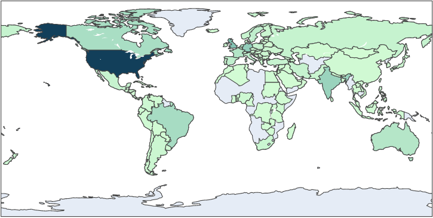
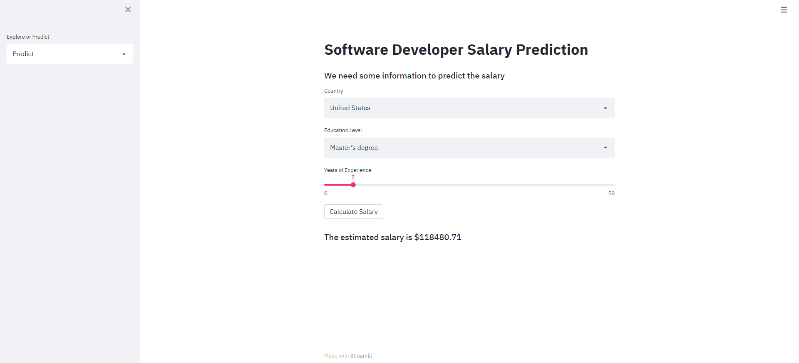
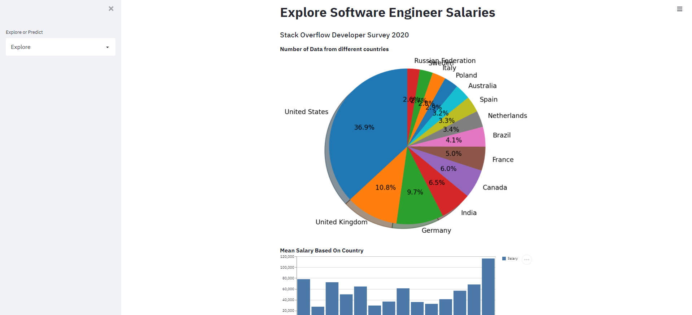

# Software Engineer Salary

A simple machine learning project to estimate the software engineer's salary.

# data 
Data is based on Stackoverflow survey 2020. The data can be downloaded in the following [page](https://insights.stackoverflow.com/survey/)

# dependency

- Scikit-learn 
- Pandas
- Numpy 
- Matplotlib 
- Streamlit 

# Data Exploration
  
# Demo 

- Estimate 
  
- Explore 
  

